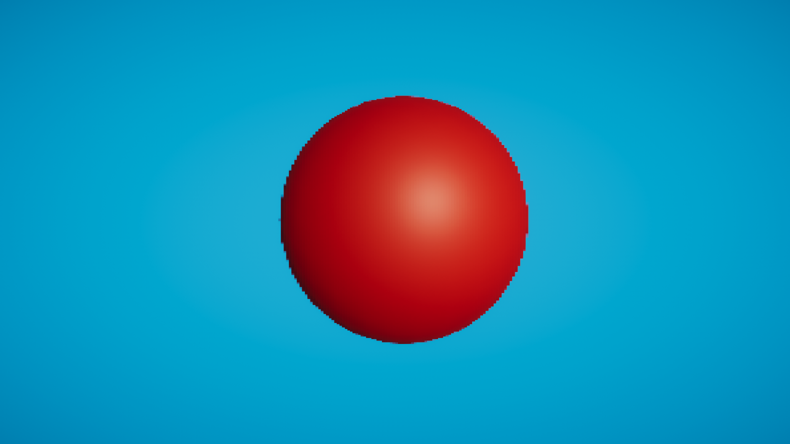

# Pixelated Fullscreen effect in Unity 2021.3f LTS

Simple shader feature to give a pixelated style to the rendering pass, useful for 2D games with 3D Elements and PSX indie games.

# Examples

### 100 Pixel Rate

### 300 Pixel Rate

### 100 Pixel Rate

### 200 Pixel Rate

### 300 Pixel Rate

